# 🎮 Bevy ECS TypeScript Implementation

A **complete** Entity Component System (ECS) implementation in TypeScript, inspired by [Bevy Engine](https://bevyengine.org/). This project demonstrates the full ECS architecture with all advanced features.

## ✅ Features Implemented

### Core ECS (100%)
- **Entity Management** - ID allocation, generations, recycling
- **Component System** - Registration, storage, metadata
- **World Container** - Central data store
- **Query System** - Type-safe component queries with filters
- **Commands** - Deferred entity operations
- **Resources** - Global singleton data
- **System Scheduling** - Stage-based execution

### Advanced Features (100%)
- **Archetypes** - Entities grouped by component layout
- **Storage Backends** - Table (dense) and SparseSet (sparse)
- **Change Detection** - Added/Changed filters, Mut<T> wrapper
- **Bundles** - Grouped component spawning
- **Events** - Double-buffered event system
- **Observers** - Reactive component hooks (OnAdd/OnChange/OnRemove)
- **Hierarchy** - Parent/Child relationships
- **Query Filters** - With/Without/Added/Changed

---

## 📊 Architecture Diagrams

### ECS Core Architecture

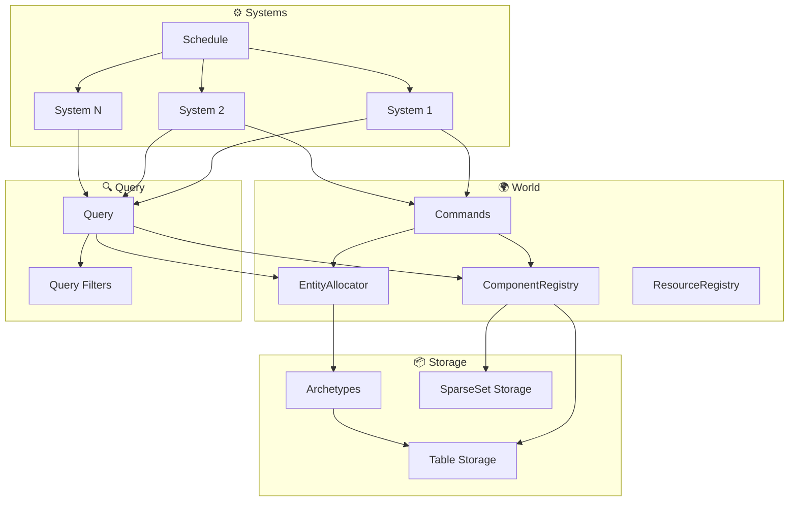

### System Execution Flow

```mermaid
flowchart LR
    subgraph "Stage.First"
        IC[inputClearSystem]
    end
    
    subgraph "Stage.PreUpdate"
        PI[playerInputSystem]
        PS[playerShootSystem]
    end
    
    subgraph "Stage.Update"
        WS[wanderSystem]
        FT[followTargetSystem]
        MS[movementSystem]
        BS[bounceSystem]
        TS[trailSystem]
    end
    
    subgraph "Stage.PostUpdate"
        LS[lifetimeSystem]
        ES[explosionSystem]
        CS[collisionSystem]
        PE[processEventsSystem]
        ESP[enemySpawnSystem]
    end
    
    subgraph "Stage.Last"
        RS[renderSystem]
        UI[uiUpdateSystem]
        UE[updateEventsSystem]
    end
    
    IC --> PI --> PS --> WS --> FT --> MS --> BS --> TS
    TS --> LS --> ES --> CS --> PE --> ESP
    ESP --> RS --> UI --> UE
    
    UE -->|"Next Frame"| IC
```

### Entity-Component Relationships

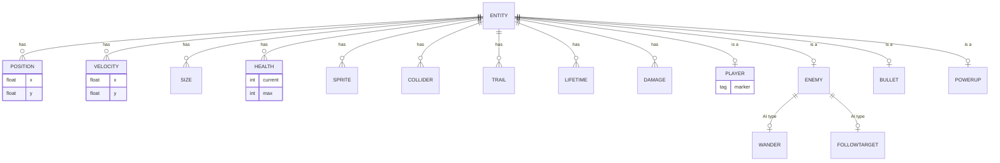

### Bundle System

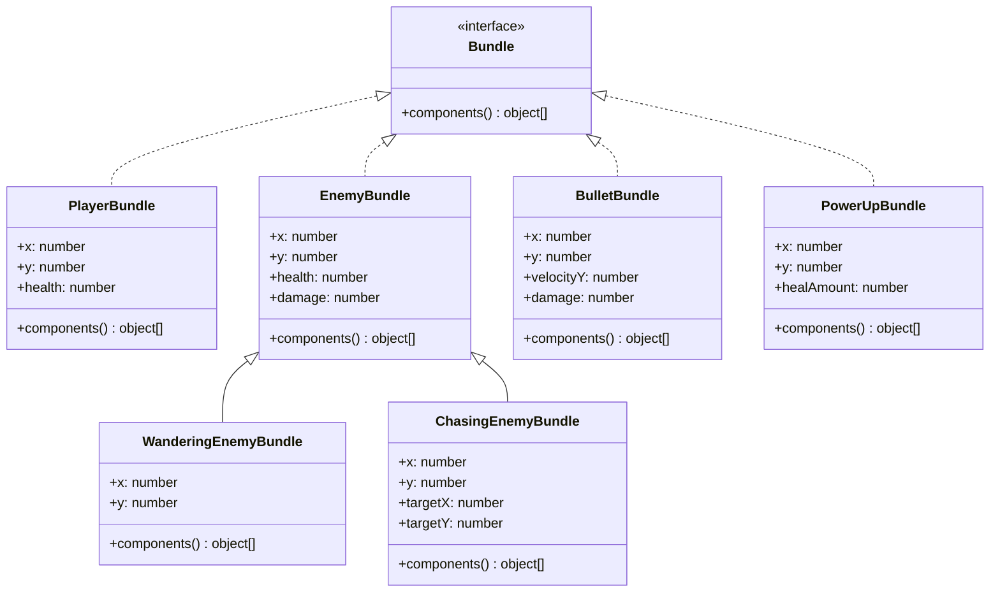

### Event System Flow

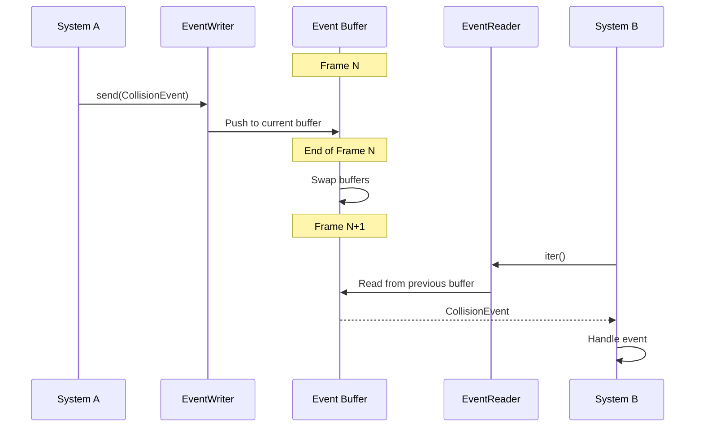

### Event Types

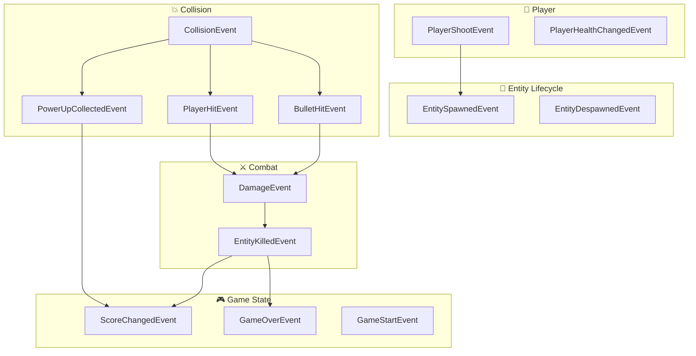

### Observer Pattern

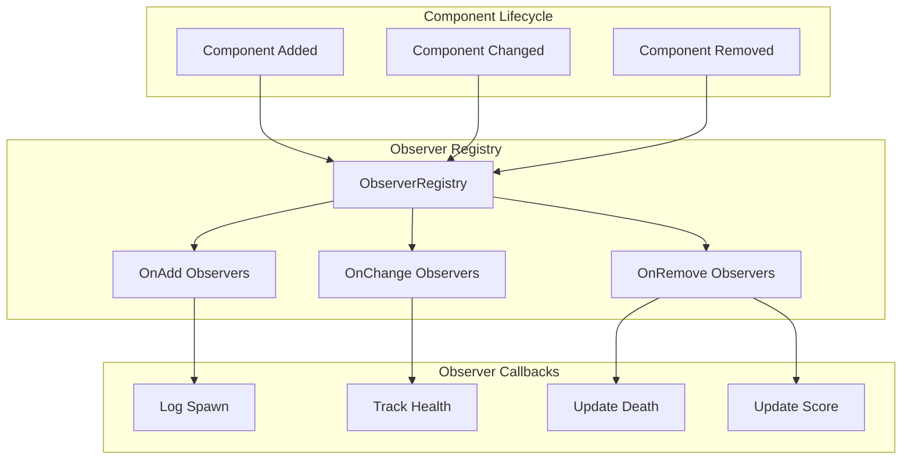

### Storage Architecture

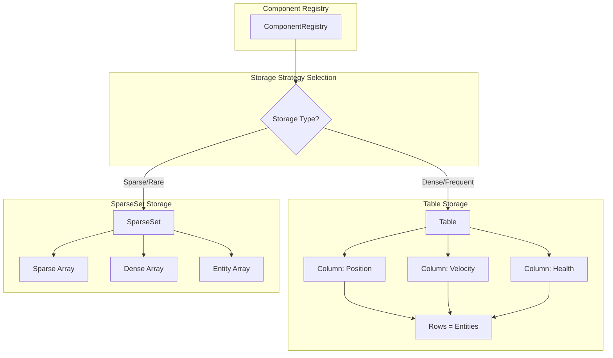

### Archetype System

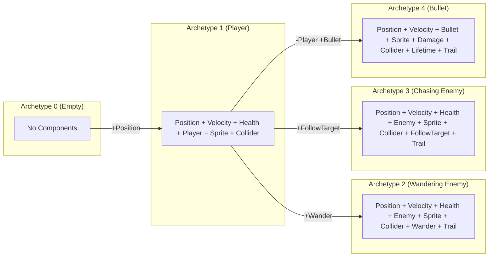

### Query System

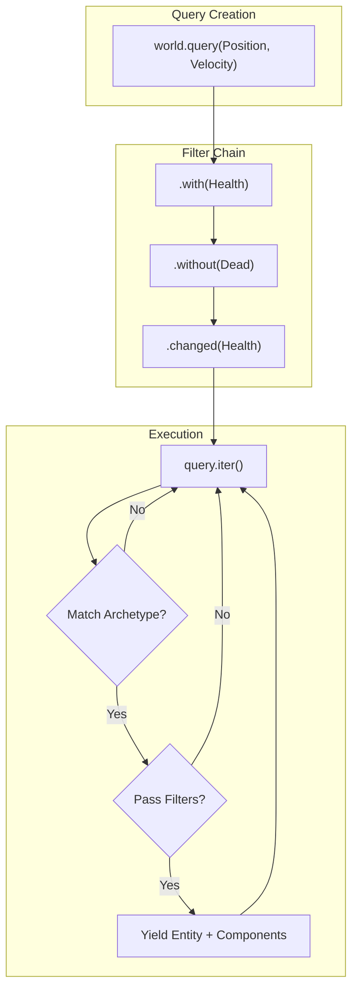

### Change Detection

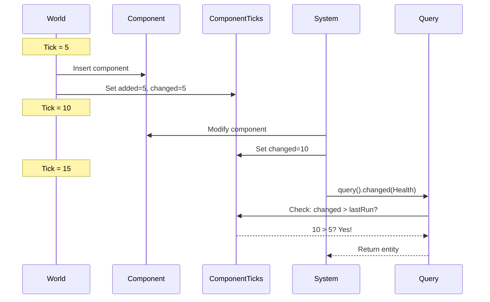

### Complete Data Flow

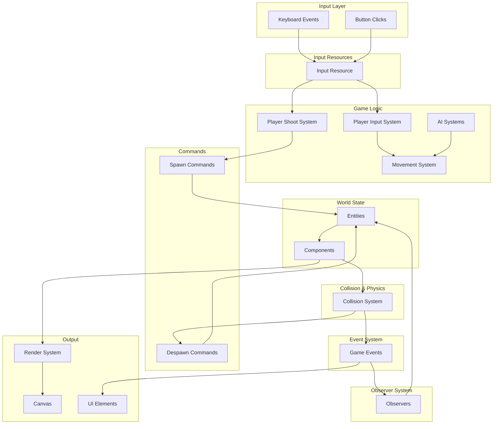

---

## 🚀 Quick Start

```bash
# Clone the repository
git clone https://github.com/nisimjoseph/ecs-typescript-game.git
cd ecs-typescript-game

# Install dependencies
npm install

# Start development server
npm run dev
```

Open http://localhost:8080 to play the demo game.

## 🎯 Game Demo

The demo game demonstrates ALL ECS features:

### Controls
- **WASD** - Move player (world directions)
- **↑/↓ Arrow Keys** - Move forward/backward (facing direction)
- **←/→ Arrow Keys** - Rotate player
- **SPACE** - Shoot in facing direction
- **Buttons** - Spawn enemies, boss, power-ups, reset

### Features Demonstrated

| Feature | How It's Used |
|---------|--------------|
| **Bundles** | `PlayerBundle`, `EnemyBundle`, `BulletBundle` for spawning |
| **Events** | `CollisionEvent`, `ScoreChangedEvent`, `GameOverEvent` |
| **Observers** | Log entity spawns, track health changes, handle deaths |
| **Query Filters** | `with(Trail)`, `without(Wander)` for targeted queries |
| **Change Detection** | Health changes trigger observer callbacks |
| **Hierarchy** | Trail points follow parent entities |

---

## 📁 Project Structure

```
ecs-typescript-game/
├── src/
│   ├── ecs/                          # Core ECS library (~4,500 lines)
│   │   ├── archetype/mod.ts          # Archetype system
│   │   ├── bundle/mod.ts             # Bundle system
│   │   ├── change_detection/mod.ts   # Change tracking
│   │   ├── component/mod.ts          # Component storage
│   │   ├── entity/mod.ts             # Entity management
│   │   ├── event/mod.ts              # Event system
│   │   ├── hierarchy/mod.ts          # Parent-child relationships
│   │   ├── observer/mod.ts           # Reactive observers
│   │   ├── query/mod.ts              # Query with filters
│   │   ├── storage/                  # Storage backends
│   │   │   ├── sparse_set.ts         # Sparse set storage
│   │   │   └── table/mod.ts          # Table storage
│   │   ├── core/                     # Core systems
│   │   │   ├── app.ts                # App builder
│   │   │   ├── commands.ts           # Deferred commands
│   │   │   ├── resource.ts           # Resources
│   │   │   ├── system.ts             # System scheduling
│   │   │   ├── types.ts              # Core types
│   │   │   └── world.ts              # World container
│   │   └── index.ts                  # ECS exports
│   │
│   ├── game/                         # Game demo (~2,000 lines)
│   │   ├── bundles.ts                # Game bundles (7 bundle types)
│   │   ├── components.ts             # Game components (16 types)
│   │   ├── events.ts                 # Game events (15 event types)
│   │   ├── observers.ts              # Game observers (12 observers)
│   │   ├── resources.ts              # Game resources (8 types)
│   │   └── systems.ts                # Game systems (16+ systems)
│   │
│   └── main.ts                       # Entry point
│
├── public/
│   └── index.html                    # HTML template
│
├── docs/                             # Documentation
│   ├── ARCHITECTURE.md               # Architecture details
│   ├── ARCHITECTURE_VIEWER.html      # Interactive diagrams
│   ├── BEVY_COMPARISON.md            # Comparison with Bevy
│   └── ...
│
├── dist/                             # Build output
├── package.json
├── tsconfig.json
├── webpack.config.js
├── LICENSE                           # MIT License
└── README.md
```

---

## 📖 Usage Examples

### Creating an App

```typescript
import { App, World } from './ecs';

const app = new App()
  .insertResource(new GameConfig())
  .insertResource(new GameEvents())
  .insertResource(new ObserverRegistry())
  .addStartupSystem(setupObservers)
  .addStartupSystem(spawnPlayer)
  .addSystem(movementSystem)
  .addSystem(collisionSystem)
  .addSystem(renderSystem)
  .run();
```

### Using Bundles

```typescript
// Define a bundle
class PlayerBundle implements Bundle {
  constructor(public x: number, public y: number) {}
  
  components() {
    return [
      new Position(this.x, this.y),
      new Velocity(0, 0),
      new Health(100, 100),
      new Player(),
      new Sprite('#00ff88', 'triangle'),
      new Collider(15, 'player')
    ];
  }
}

// Spawn with bundle
const bundle = new PlayerBundle(400, 300);
const builder = world.spawn();
for (const component of bundle.components()) {
  builder.insert(component);
}
```

### Using Events

```typescript
// Define event
class CollisionEvent {
  constructor(
    public entityA: Entity,
    public entityB: Entity,
    public damage: number
  ) {}
}

// Send event
const events = world.getResource(GameEvents);
events.collision.send(new CollisionEvent(bullet, enemy, 25));

// Read events (in another system)
for (const event of events.collision.iter()) {
  console.log(`Collision: ${event.damage} damage`);
}
```

### Using Observers

```typescript
// Setup observer for enemy spawns
registry.register(
  onAdd(Enemy)
    .label('log_enemy_spawn')
    .priority(100)
    .run((entity, enemy) => {
      console.log(`👾 Enemy spawned: ${entity.id}`);
      events.entitySpawned.send(new EntitySpawnedEvent(entity, 'enemy'));
    })
    .build()
);

// Setup observer for health changes
registry.register(
  onChange(Health)
    .run((entity, health) => {
      if (health.isDead()) {
        console.log(`☠️ Entity ${entity.id} died!`);
      }
    })
    .build()
);
```

### Using Query Filters

```typescript
// Query enemies with Trail component
const trailedEnemies = world.query(Position, Enemy).with(Trail);

// Query enemies without Wander (chasers only)
const chasers = world.query(Position, Enemy).without(Wander);

// Query recently added enemies
const newEnemies = world.query(Position, Enemy).added(Enemy);

// Query entities with changed health
const damaged = world.query(Position, Health).changed(Health);
```

---

## 🔧 Building

```bash
# Development with hot reload
npm run dev

# Production build
npm run build
```

---

## 📊 Performance

| Metric | Value |
|--------|-------|
| **FPS** | 165+ stable |
| **Entity Operations** | O(1) |
| **Query Iteration** | Cache-friendly |
| **Memory** | Archetype-optimized |
| **Events** | Double-buffered |

---

## 🏗️ Architecture Summary

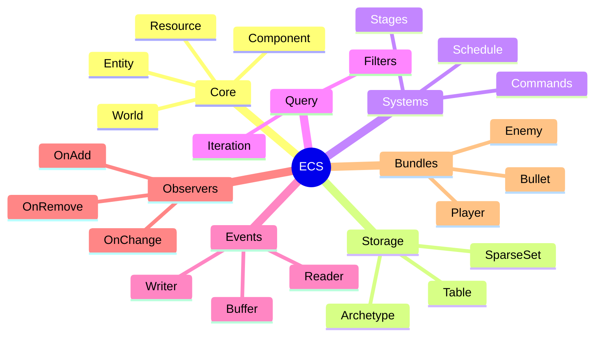

---

## 🎮 Game Systems Overview

| System | Stage | Purpose |
|--------|-------|---------|
| `inputClearSystem` | First | Clear input state |
| `playerInputSystem` | PreUpdate | Handle WASD movement |
| `playerShootSystem` | PreUpdate | Handle shooting |
| `wanderSystem` | Update | Enemy AI wandering |
| `followTargetSystem` | Update | Enemy AI chasing |
| `movementSystem` | Update | Apply velocity |
| `bounceSystem` | Update | Wall bouncing |
| `trailSystem` | Update | Trail effects |
| `lifetimeSystem` | PostUpdate | Despawn expired entities |
| `explosionSystem` | PostUpdate | Explosion effects |
| `collisionSystem` | PostUpdate | Handle collisions + events |
| `processEventsSystem` | PostUpdate | Process game events |
| `enemySpawnSystem` | PostUpdate | Auto-spawn enemies |
| `renderSystem` | Last | Draw everything |
| `uiUpdateSystem` | Last | Update UI stats |
| `updateEventsSystem` | Last | Swap event buffers |

---

## 📜 License

This project is licensed under the MIT License - see the [LICENSE](LICENSE) file for details.

Feel free to use this implementation for learning or production.

## 🙏 Acknowledgments

- [Bevy Engine](https://bevyengine.org/) - Architecture inspiration
- [Bevy ECS Source](https://github.com/bevyengine/bevy/tree/main/crates/bevy_ecs) - Reference implementation
