# 🏗️ ECS Architecture Documentation

This document provides detailed architectural diagrams for the TypeScript ECS implementation.

> **📊 [View Interactive Diagrams →](./ARCHITECTURE_VIEWER.html)**  
> Open `ARCHITECTURE_VIEWER.html` in your browser to see all diagrams rendered visually with interactive navigation.

---

## 📊 High-Level Overview

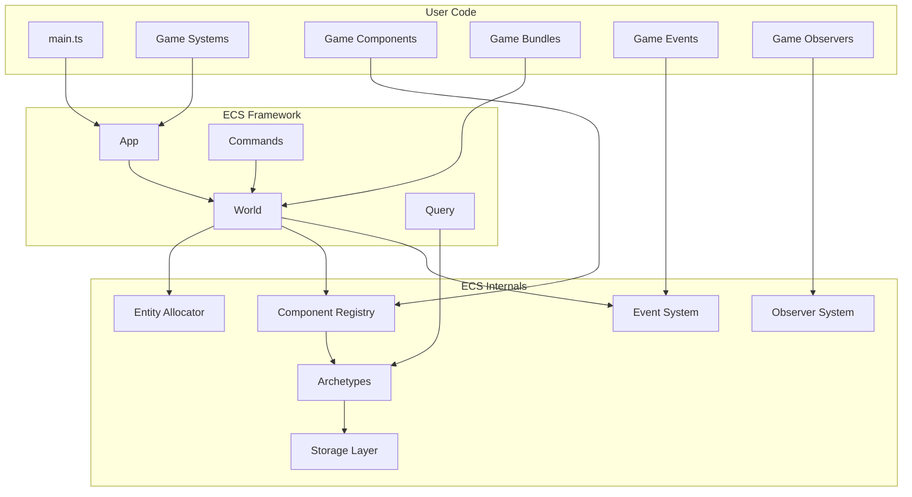

---

## 🌍 World Architecture

The `World` is the central container for all ECS data.

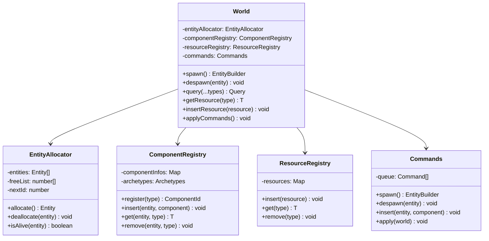

---

## 📦 Storage Architecture

### Archetype System

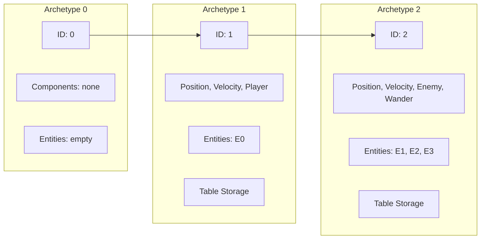

### Table Storage Detail

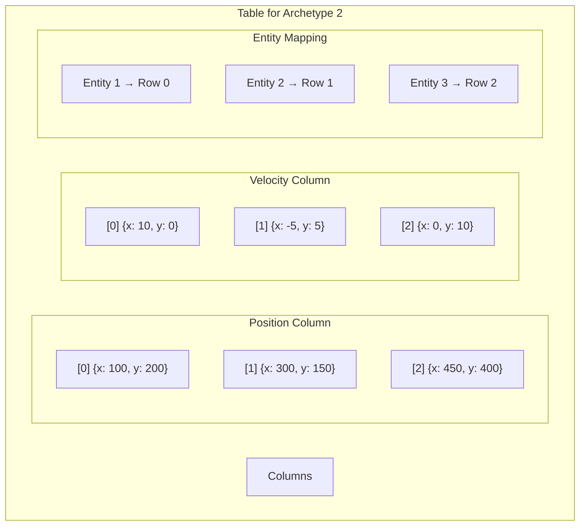

### SparseSet Storage

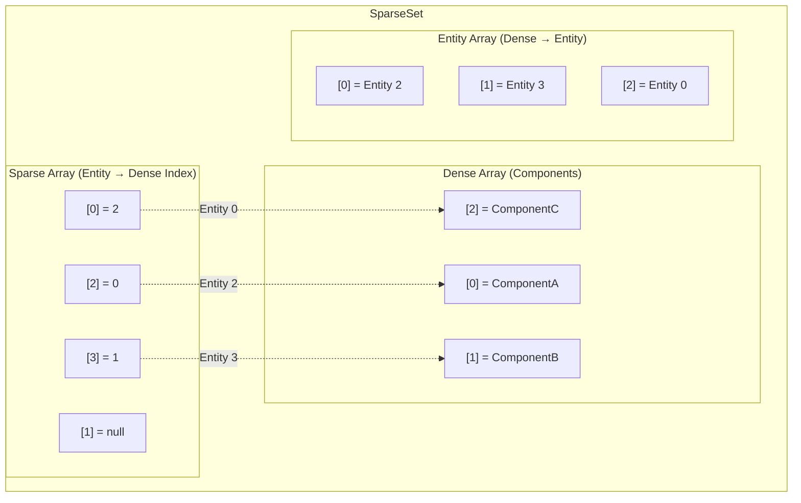

---

## 🔍 Query System

### Query Execution Flow

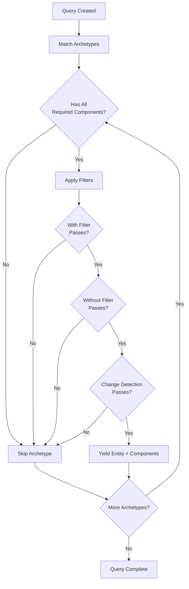

### Query Filter Types

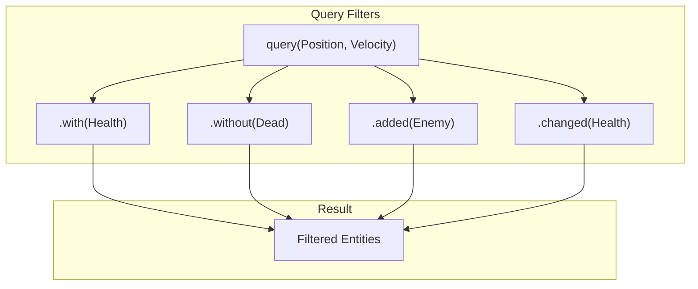

---

## 📡 Event System

### Double-Buffered Events

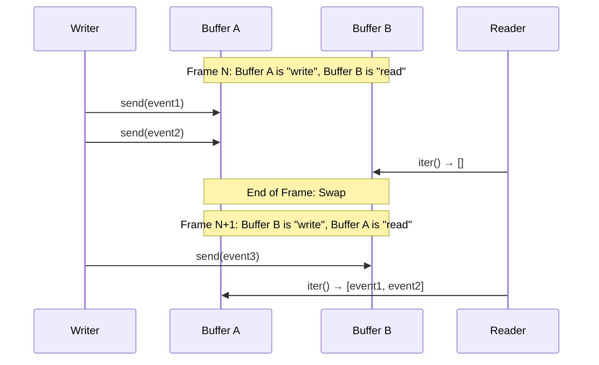

### Event Flow in Game

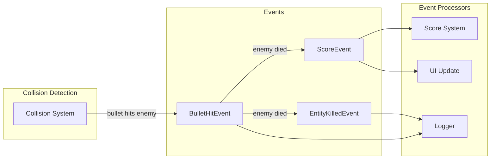

---

## 👁️ Observer System

### Observer Registration

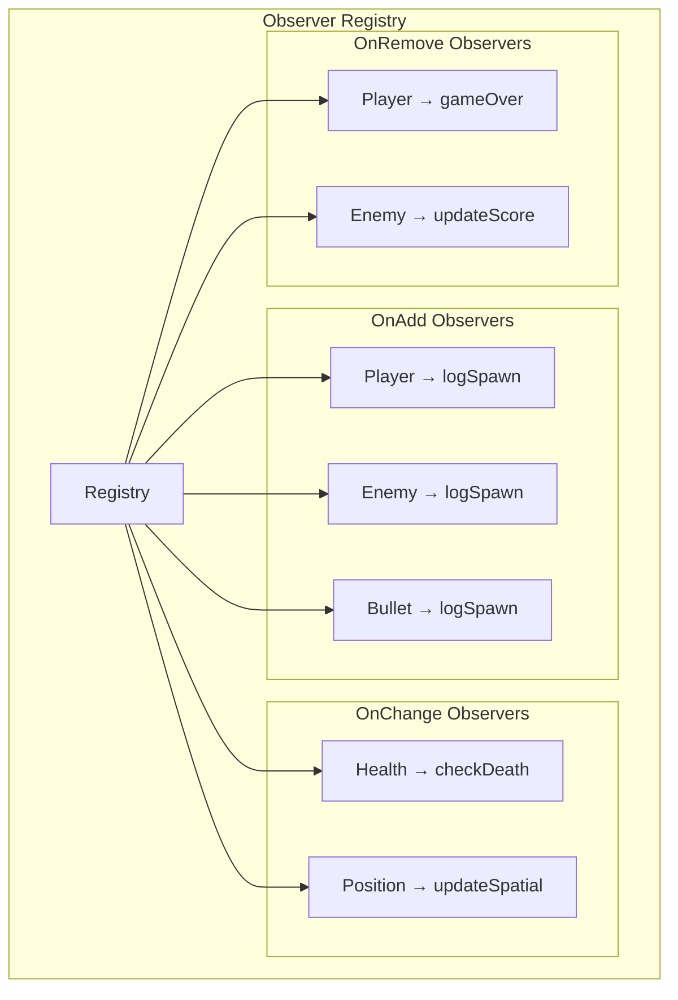

### Observer Trigger Flow

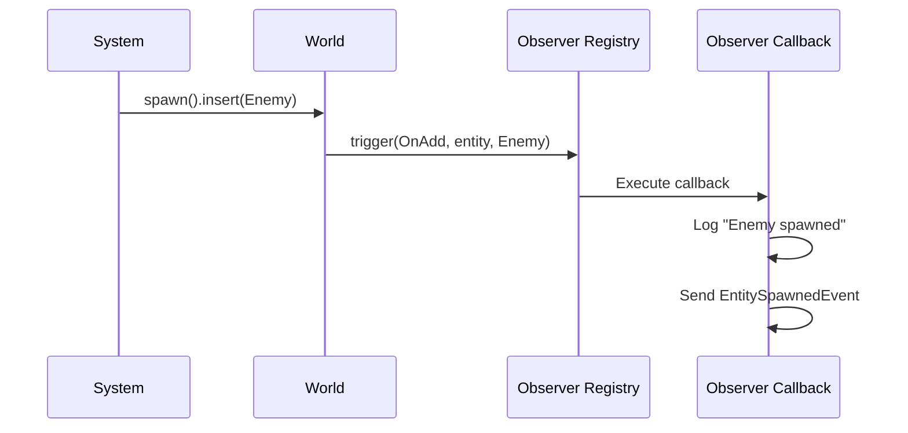

---

## 📦 Bundle System

### Bundle Hierarchy

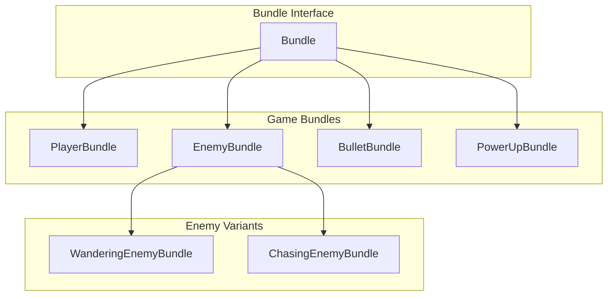

### Bundle Spawning

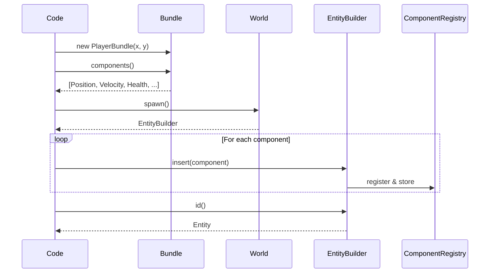

---

## ⚙️ System Scheduling

### Stage Execution Order

```mermaid
gantt
    title System Execution Per Frame
    dateFormat X
    axisFormat %s
    
    section Stage.First
    inputClearSystem :a1, 0, 1
    
    section Stage.PreUpdate
    playerInputSystem :a2, 1, 2
    playerShootSystem :a3, 2, 3
    
    section Stage.Update
    wanderSystem :a4, 3, 4
    followTargetSystem :a5, 4, 5
    movementSystem :a6, 5, 6
    bounceSystem :a7, 6, 7
    trailSystem :a8, 7, 8
    
    section Stage.PostUpdate
    lifetimeSystem :a9, 8, 9
    explosionSystem :a10, 9, 10
    collisionSystem :a11, 10, 11
    processEventsSystem :a12, 11, 12
    enemySpawnSystem :a13, 12, 13
    
    section Stage.Last
    renderSystem :a14, 13, 14
    uiUpdateSystem :a15, 14, 15
    updateEventsSystem :a16, 15, 16
```

### System Dependencies

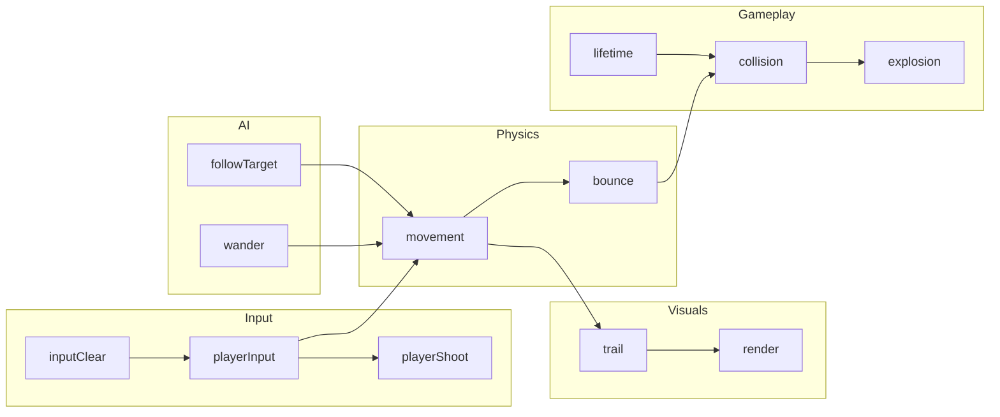

---

## 🔄 Change Detection

### Tick-Based Tracking

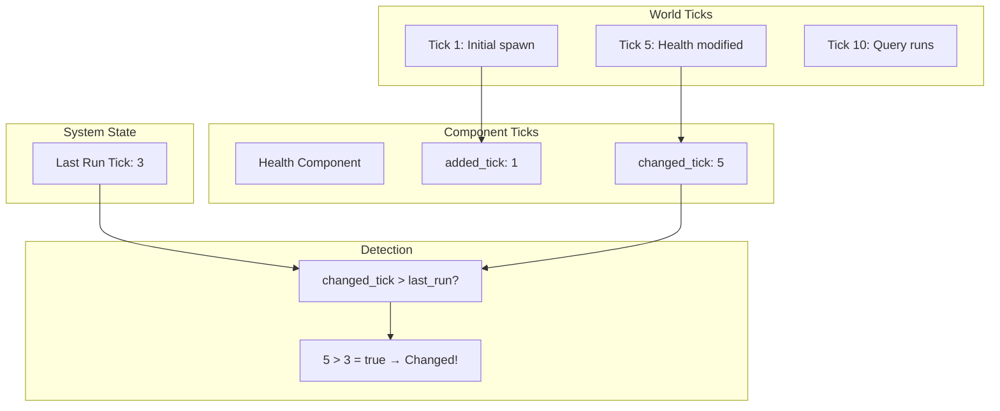

---

## 🎮 Game Loop

### Complete Frame Flow

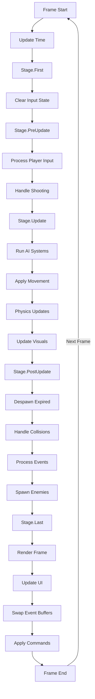

---

## 📝 Summary

This architecture provides:

1. **Separation of Concerns** - Each module has a single responsibility
2. **Cache Efficiency** - Archetype-based storage for fast iteration
3. **Type Safety** - Full TypeScript generics throughout
4. **Extensibility** - Easy to add new components, systems, events
5. **Reactivity** - Observers respond to component lifecycle
6. **Decoupling** - Events allow systems to communicate without dependencies

---

**Document Version**: 1.0
**Last Updated**: January 1, 2026
